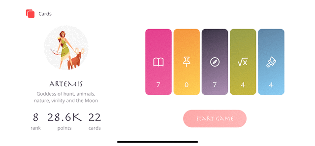
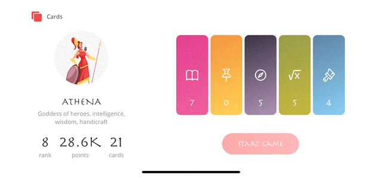
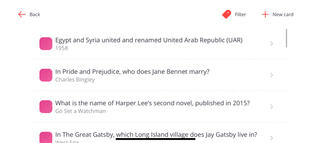

# Flashcards  
>
> Application to memorize information.
>
> Written in SwiftUI. Tested on iPhone 11.

 

### Functionality of the App
1. Create cards to memorize, edit and delete them.
2. Organize cards in the categorized list.
3. Train cards in a game form with timer on.
4. Filter the list of the cards by categories if needed. Change an image for the categories.
5. Option to retry wrong cards.
6. Earn points and get levels according to the game result.
7. Choose a hero to play with, unlock new ones with the progress.

 

### Screenshots

*Game mode: memorizing*

 

*Profile Hero*

 

*List of cards, filter by category, changing an image for the chosen category with the Long Press*

 

*Editing & deleting*

 

*Adding a card*

 

### Features
- Haptics and animation.
- Custom stepper view, alert.
- Implementation of the cards filter by categories.
- Timer with Notification Center that pauses if the app is hidden.
- Data consistency with the Documents Directory. Decoding default data from the JSON file.
- Accessibility (VoiceOver; Differentiate without color).
- Gamification.

 

### Communication
If you find a bug or want to discuss a new feature, feel free to [reach out](mailto:Valerika.Hello@gmail.com).

 

### Credits

Amazing graphic images of Greek Gods are made by [macrovector](https://www.freepik.com/macrovector).
